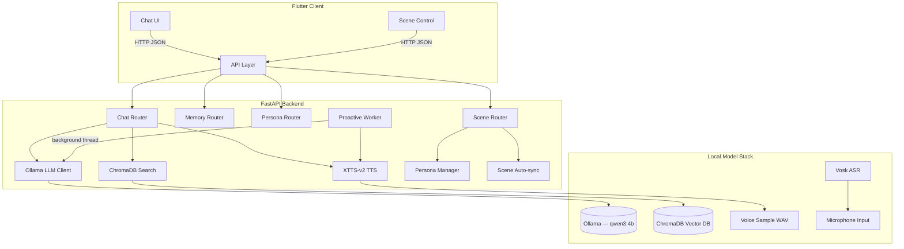

# Aegis-Agent

**A fully offline AI assistant system with long-term memory, real-time voice interaction, and multi-persona support — built from scratch as a personal engineering project.**

> Designed and implemented independently. Runs entirely on local hardware with no cloud APIs, no data upload, and no external dependencies at runtime.

---

## What This Project Does

Aegis-Agent is an end-to-end AI companion system that I built to explore how modern AI components fit together in a real product. It combines:

- A **local LLM** (via Ollama) for natural conversation
- A **vector memory system** (ChromaDB + sentence-transformers) that gives the AI persistent, searchable long-term memory across sessions
- **Voice cloning TTS** (Coqui XTTS-v2) that generates speech in a custom voice from a small WAV sample
- **Offline speech recognition** (Vosk) for microphone input with no network required
- A **context-aware persona engine** that switches between professional and intimate conversation modes based on scene, user input, or manual control
- A **Flutter mobile client** (Android + iOS) that connects to the backend over local Wi-Fi

Everything runs on a single consumer GPU (tested on RTX 3050 4 GB VRAM).

---

## System Architecture



---

## Technical Highlights

### Long-Term Memory
Every conversation turn is embedded and stored in ChromaDB. On each new message, the top-5 semantically similar memories are retrieved and prepended to the LLM prompt as context — giving the AI genuine recall without fine-tuning.

### Voice Cloning Pipeline
XTTS-v2 performs zero-shot voice cloning: given a 10–20 second WAV reference sample, it synthesises any text in that voice, in real time. Optimised to run within 4 GB VRAM by capping synthesis length and managing GPU memory between the LLM and TTS models.

### Persona & Scene Engine
A lightweight state machine manages two named personas (`aegis_pro` / `aegis_intim`), each mapped to a different LLM configuration and voice sample. Scene changes (`work`, `remote`, `home`, `sleep`) trigger automatic persona transitions, with a manual lock mechanism that overrides all automatic logic.

### Proactive Messaging
A background thread (`proactive_worker.py`) polls an enable flag and periodically generates unprompted messages using the LLM, synthesises them to audio, and queues them for the client to consume via long-polling.

### Clean Architecture
The backend is structured as a Python package with clear separation of concerns:

```
backend/
├── api/       ← FastAPI routers (chat, memory, persona, scene)
├── agent/     ← Persona, scene, and proactive message logic
├── llm/       ← Ollama HTTP client (swappable)
├── memory/    ← ChromaDB vector store operations
├── speech/    ← Vosk STT + XTTS-v2 TTS
└── config/    ← Cross-platform path configuration (pathlib)
```

Replacing the LLM provider, TTS engine, or ASR model requires changing a single module — the rest of the system is unaffected.

---

## Tech Stack

| Layer | Technology | Notes |
|---|---|---|
| Backend API | **FastAPI** + Uvicorn | Async, auto-docs at `/docs` |
| LLM inference | **Ollama** | Any GGUF model; default qwen3:4b |
| Vector memory | **ChromaDB** + sentence-transformers | Fully local embeddings |
| TTS voice cloning | **Coqui XTTS-v2** | Zero-shot, multilingual |
| ASR speech-to-text | **Vosk** | Offline, < 50 ms latency |
| Mobile client | **Flutter 3** | Android APK + iOS IPA |
| Config | Python **pathlib** | Works on Windows, macOS, Linux |

---

## Getting Started

### Prerequisites

- Python 3.10+
- [Ollama](https://ollama.com) installed and running
- NVIDIA GPU recommended (4 GB VRAM minimum for XTTS-v2)

### Install

```bash
git clone https://github.com/your-username/Aegis-Agent.git
cd Aegis-Agent
python -m venv venv && source venv/bin/activate  # Windows: venv\Scripts\activate
pip install -r requirements.txt
```

### Configure

1. Pull an Ollama model: `ollama pull qwen3:4b`
2. Update `MODEL_PRO` / `MODEL_INTIM` in `backend/config/config.py`
3. Download the [Vosk model](https://alphacephei.com/vosk/models) → extract to `models/vosk/`
4. Place a voice WAV sample at `sample_voice/formal/01.wav` (see `sample_voice/README.md`)

### Run

```bash
uvicorn backend.app:app --host 0.0.0.0 --port 8000 --reload
```

API docs: **http://localhost:8000/docs**

---

## API Overview

| Method | Endpoint | Description |
|---|---|---|
| `POST` | `/chat` | Send message → memory-augmented LLM reply |
| `POST` | `/speech` | WAV upload → transcribed text (Vosk) |
| `POST` | `/tts` | Text → cloned voice WAV (XTTS-v2) |
| `POST` | `/scene` | Switch scene, auto-sync persona |
| `POST` | `/persona` | Manually set persona |
| `POST` | `/persona_lock` | Lock persona, disable auto-switching |
| `GET` | `/status` | Persona, scene, memory count, lock state |
| `GET` | `/memories` | List all memory entries |
| `POST` | `/memory_reload` | Import chat history into ChromaDB |
| `POST` | `/memory_clear` | Wipe all memories |
| `GET` | `/pending_messages` | Poll proactive message queue |

---

## Flutter Client

Located in `frontend/flutter_app/`. Update the backend IP in `lib/main.dart`:

```dart
const String kBackendHost = '192.168.1.xxx'; // your local machine IP
```

```bash
cd frontend/flutter_app
flutter pub get
flutter build apk --release   # Android
flutter build ipa --release   # iOS (requires macOS + Xcode)
```

---

## Project Structure

```
Aegis-Agent/
├── backend/
│   ├── app.py              # FastAPI app — registers routers, starts worker
│   ├── api/                # Route handlers (chat, memory, persona, scene)
│   ├── agent/              # Persona manager, scene engine, proactive worker
│   ├── config/             # config.py — all paths, model names
│   ├── core/               # Pydantic request/response models
│   ├── llm/                # Ollama HTTP client
│   ├── memory/             # ChromaDB wrapper + file importer
│   └── speech/             # Vosk ASR + XTTS-v2 TTS + audio conversion
├── frontend/
│   └── flutter_app/        # Flutter mobile client
├── docs/                   # User guide, developer guide, quick start
├── scripts/                # start_backend.bat / .sh
├── sample_voice/           # Place your WAV voice samples here (git-ignored)
├── models/                 # Place downloaded models here (git-ignored)
├── sample_data/            # Optional: chat history for memory import
└── tests/                  # Smoke tests
```

---

## Roadmap

- [ ] Streaming LLM responses (SSE)
- [ ] Bluetooth peripheral control (bleak)
- [ ] Wi-Fi based automatic scene detection
- [ ] Desktop floating notification widget (Windows overlay)
- [ ] Web UI (React or vanilla JS)
- [ ] Docker deployment option

---

## License

MIT — see [LICENSE](LICENSE) for details.


# Aegis-Agent 本地离线AI助手

### 开发工具说明
本项目使用Claude Code作为开发辅助工具，仅用于生成基础代码框架、优化语音算法流程、规范代码格式与辅助文档撰写；
项目整体架构设计、业务逻辑梳理、全模块调试、前后端联调与功能迭代均由本人独立完成。

## 项目简介
一款具备长期记忆、语音交互、离线本地大模型推理的轻量化AI客户端，采用Python后端+Flutter跨平台前端架构，完整实现本地大模型部署、对话记忆持久化、语音转文字/语音合成全链路。
> 个人独立开发，用于学习本地LLM工程化、多端交互、语音AI流水线。

## 核心功能
1. 离线本地大模型推理，无需联网调用API
2. 对话长期记忆存储，支持上下文检索历史会话
3. 实时语音交互：ASR语音输入 + TTS语音播报回复
4. 前后端分离架构：Python后端推理服务 + Flutter可视化客户端
5. 配套测试脚本、开发依赖、文档与示例数据

## 技术栈
- 后端：Python、FastAPI / Uvicorn、Ollama 本地模型推理、ChromaDB 、Vosk（ASR）、XTTS(TTS)
- 前端：Flutter、Dart、Desktop UI
- 语音模块：ASR语音识别、TTS语音合成
- 工程化能力：前后端分离架构设计RESTful、API通信、本地模型部署与调度、模块化语音流水线
- 环境管理：requirements.txt 标准化依赖


## 快速部署教程
### 1. 环境安装
```bash
# 克隆仓库
git clone https://github.com/llz616900-hash/Aegis-Agent.git
cd Aegis-Agent
# 安装依赖
pip install -r requirements.txt
2d08703ed17f674808f9a51df091a87f64c2534d
